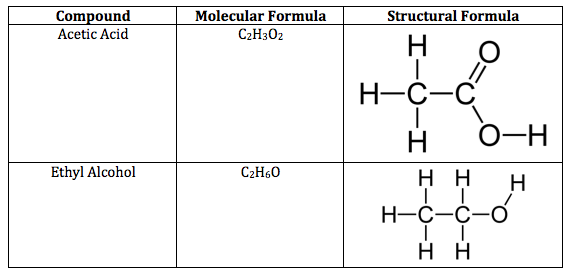

# CHM121 Lecture 20240904

- [x] #task Finish tables  [priority:: low]  [completion:: 2025-05-06]

## Chemical Bonds

Compounds are composed of atoms held by **chemical bonds**

2 types:

- Ionic: mostly non-metal
- Covalent

### Ionic Bonds

Occur between metals and non-metals, invovle transfer of electrons from the metal atom to the nonmetal atom

The metal atom then becomes a **cation** while to nonmetal atom becomes an **anion**

Oppositely chargd together

### Covalent Bonds

Occur between two+ nonmetals, composing a molecule, also called **molecular compounds**.

## Chemical Formula

Know the chemical formula names:

- Water : Dihydrogen Monoxide : $\ce{H_{2}O}$
- Carbon Tetrachloride : $\ce{CCl_{4}}$

Tells you what elements are involved and the mole ratio.

> [!info] Example
> If one mole of $\ce{CO_{2}}$ contains two moles of oxygen and one mole of carbon.

Three types:

- Emperical Formula
- Molecular Formula
- Structural Formula

### Emperical Formula

Gives *relative number* of atoms of each element in a compund.

> [!info] Example
> Hydrogen Peroxide ($\ce{H_{2}O_{2}}$) is represented as $\ce{HO}$

To convert to molecular formula, finding the what $n$-th place is needed.

### Molecular Formula

Gives **actual number** of atoms of each element in a compound.

> [!info] Example
> Hydrogen Peroxide is represented as ($\ce{H_{2}O_{2}}$)

### Structural Formula

Represents how the molecule is structred in physical reality.

## Ionic Compounds

Ionic compounds are a cluster of ions, hence are not molecules.
Instead, refer to ionic compounds as **Formula Unit**

### Determening the formula from name (ionic bond)

Find the difference of both elements to nearest noble gas, switch charges.

> [!info] Example
> $\ce{Al^{3+}}+O^{2-}\rightarrow Al_{2}O_{3}$
> $\ce{Mg^{2+}}+Cl^{1-}\rightarrow Mg_{1}Cl_{2}$

### Finding the charge 

The charge of all the ions must be equal to zero.

Metals always are positive, nonmetals always are negative.

> [!info] Example
> $\ce{FeCl_{3}}$ has $\ce{Fe}$'s charge equal to $3$, because $\ce{Cl}$ has
> difference from noble gas of $-1$, leading to the equation with $\ce{Fe}$'s ion as $x$,
> $\ce{Fe+Cl_{3} \rightarrow FeCl_{3}}$
>
> $x+3(-1)=0$
>
> $x-3=0$
>
> $x=3$
>
> $\ce{Fe(III)Cl_{3}}$

## Naming Ionic Compounds

These are inorganic compounds

Use the name of metal + name of nonmetal without the need of numerical prefix.

## Type 1

Metal forms only one type of ion.

## Type 2

Metal forms more than two types of ion.

## Polyatomic Ions

Ionic compounds that are composed of groups of covalently bonded atoms with an overall charge.

Contains compounds like Acetate ($\ce{C_{2}H_{3}O_{2}^-}$)

## Hydrated Ionic Compounds

Hydrates are ionic compounds containing a specific number of water molecules associated with each formula unit

> [!info] Example
> Formula of epsom salts:
> $\ce{MgSO_{4} \times 7H_{2}O}$
>
> Systematic name is *magnesium sulfate heptahydrate*

| Prefix Name | number |
| --- | --- |
| Hemi | $\frac 1 2$ |
| Mono | $1$ |
| Di  |$2$ |
| Tri | $3$ |
| Tetra | $4$ |
| Penta | $5$ |
| Hexa | $6$ |
| Hepta | $7$ |
| Octa | $9$ |

## Molecular Compounds

Here we use numerical prefixes.

> [!info] Example
> Carbon Monoxide ($CO$)
> Dihydrogen Monoxide ($H_{2}O$)

## Acids

Acids are molecular compounds that release hydrogen ions

- Sour taste
- Dissolve many metals
- Generally starts with $H$ unless organic acid
- $\ce{HCI}$ is a molecular compound that, when dissolved in water, forms $\ce{H^+_{(aq)}}$ and $\ce{Ck^-_{(aq)}}$ ions

Binary acids have $\ce{H^+}$ cation and nonmetal anion

Oxyacids have $\ce{H^+}$ cation and polyatomic anion

## Finding Empirical Formula Ratio

1. Find molar mass of each element
2. Divide both by the lesser element mass

> [!info] example
> $\ce{CH_3}$
>
> $\ce{C=79.89g \times \frac{1mol}{12.01}=6.651}$

## Empirical to Molecular

Formula

$$
n=\frac{\text{molar mass}}{\text{empirical formula mass}}
$$

## Empirical from Mass Percent

1. Convert percentages to gram
	1. Assume you start with 100g of compound
2.  Good luck

## Combustion Analysis

Burn a known mass of compound and weigh the amounts of elements

## Organic Compounds

Organic compounds were easily decomposed and couldn't be made in lab

Inorganic compounds were difficult to decompose but could be synthesised.

Made mainly made of carbon and hydrogen, but sometimes oxygen, nitrogen, phosphorous, sulfur.

Key element of organic chemistry is **carbon**

## Functional Groups

| Name       | Formula       | Use                              |
| ---------- | ------------- | -------------------------------- |
| Methane    | $\ce{CH_4}$   | Primary Component in natural gas |
| Propane    | $\ce{C_3H_8}$ | LP gas for stove                 |
| $n$-Butane | $\ce{C_3H_8}$ |                                  |

## Families of Organic Compounds
