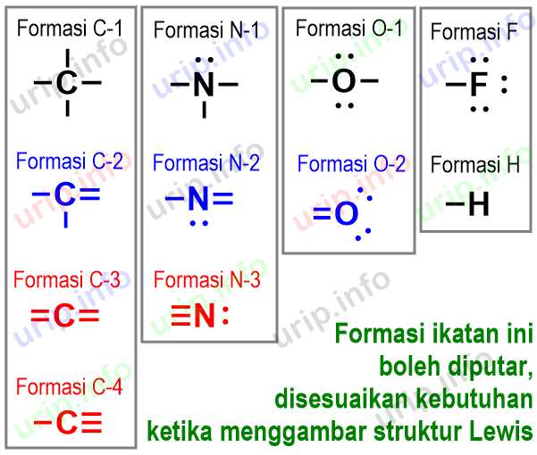

# CHM121 Lecture 20241030

## Energi Ionisasi

Energi paling minimum supaya menghapus elektron dari atom atau ion.
- Gas
- Proses endotermik 
- Elektron velensi paling mudah dihapus, energi ionisasi terendah.
- $M(g) + IE_1 \rightarrow M^{1+}(g) + 1e^-$
	- Energi ionisasi pertama = energi supaya menghapus elektron dari atom netral.
- $M^{+1}(g) + IE_2 \rightarrow M^{2+}(g) + 1e^-$
	- energy ionisasi kedua = energi supaya menghapus elektron dari ion 1+, etc.
	
Energi ionisasi semakin tinggi asal muatan nuklir efektif mengurangi.

## Afinitas Elektron

Energi akan dilepaskan kalau atom netral memperoleh elektron.
- Gas
- $M(g)+1e^- \rightarrow M^{1-}(g)+EA$

Afinitas elektron bisa definisikan sebagai eksotermik tetapi juga bisa endotermik.

Semakin banyak energi dilepaskan, semakin besar afinitas elektron.
- Semakin negatif nomor, semakin besar afinitas elektron

> [!info] Contoh
> $O^-(g) + 1e^- \rightarrow O^{2-}(g) + EA_2$

## Karakter Logam

**Karakter logam** adalah seberapa dekat properti elemen cocok dengan properti ideal logam.

Karakter logam *mengurangi dari kiri ke kanan* sepanjang periode.

Karakter logam *meningkat ke bawah* kolom.

# Ikatan Kimia: Model Lewis

Ikatan Kimia membentuk untuk merendahkan energi potensial antara partikel muat yang menyusun atom

## Ikatan logam

Energi ionisasi yang relatif rendah memperoleh mereka untuk melepaskan elektron lebih mudah

## Elektron Velensi dan Ikatan

Dipegang lebih longgar

## Struktur Lewis Atom

Mencatat dot sekeliling simbol untuk menunjukan elektron velensi. 

**Wajib ikuti hukum oktat**

Symbol Lewis bisa menunjukkan transfer elektron dari atom logam ke atom non-logam, menghasilkan ion yang tertarik di antara mereka, sebab itu, mengikatkan.

## Kisi Kristal

Atraksi elektrostatik tidak terarah!
- Tiada pasangan anion-kation langsung.

Energi Kisi adalah energi yang mengikatkan elektron untuk menghasilkan senyawa.

Energi Kisi adalah proses endotermik.

Oleh sebab itu, kisi kristal tidak adakan molekul ionik.

$$
\text{Energi}=\frac{Muatan}{Jarak}
$$

## Properti Senyawa Ionik

Padatan kristal yang keras dan rapuh.

Titik leleh umumnya > 300c

Keadaan cair menghantarkan listrik.

