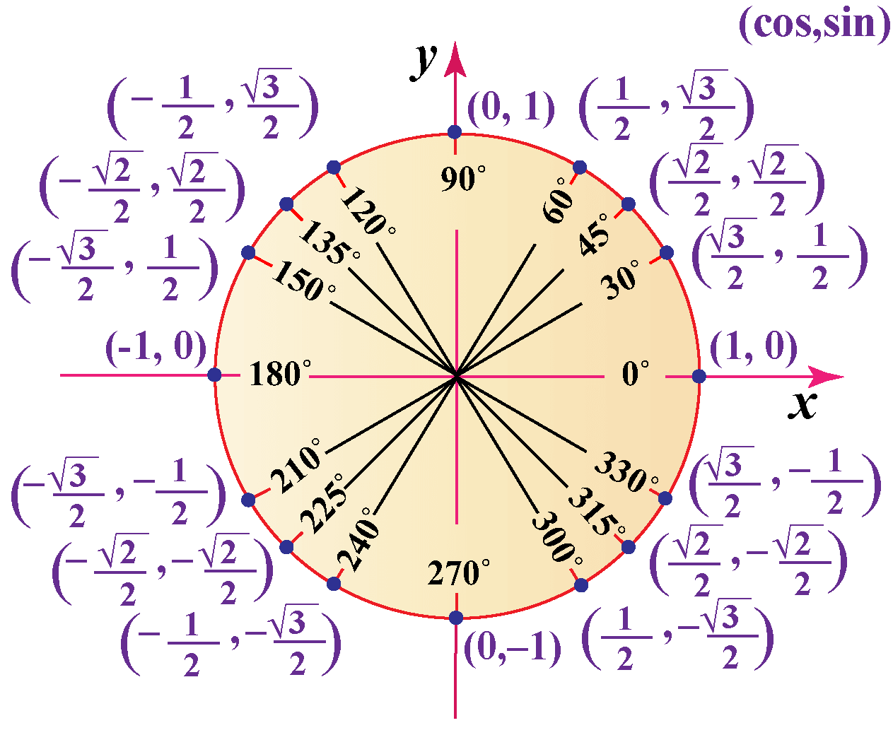

# Inverse Cosine Function

The function denoted by $\cos^{-1}(x)$ or $\arccos(x)$ is the inverse
of the restricted cosine function $y=\cos(x)$ for $0\le x \le \pi$ therefore:
$$
y = \cos^{-1}(x) \lesseqqgtr \cos(y) = x
$$
$$
y = \arccos(x) \lesseqqgtr \cos(y) = x
$$
where:
- Domain: $-1\le x \le 1$
- Range: $0 \le y \le \pi$

> [!info] Evaluate:
> 1. $\cos^{-1}(\frac{5}{4})$
>    1. Check Domain
>   $\cos^{-1}(\frac{5}{4})$ is undefined
> 2. $\cos^{-1}(-\frac{\sqrt{3}}{2})$
> 	1. $-\frac{\sqrt{3}}{2}$ is within the domain $[-1,1]$
> 	2. $\cos^{-1}(-\frac{\sqrt{3}}{2})=\theta$
> 	3. Use inverse property: $\cos(\theta)=-\frac{\sqrt{3}}{2}$ where $0 \le \theta \le \pi$
> 	4. Place result in range of $\cos^{-1}$ (Please refer to a unit semi-circle chart for inverse cosine if needed.)

# Inverse Tangent Function

The function denoted by $\tan^{-1}(x)$ or $\arctan(x)$ is the inverse
of the restricted tangent function $y=\tan(x)$ for $0\le x \le \pi$ therefore:
$$
y = \tan^{-1}(x) \lesseqqgtr \tan(y) = x
$$
$$
y = \arctan(x) \lesseqqgtr \tan(y) = x
$$
where:
- Domain: $-\infty \le x \le \infty$
- Range: $-\frac{\pi}{2} \le y \le \frac{\pi}{2}$

