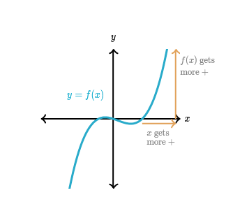
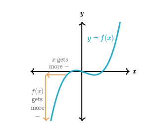
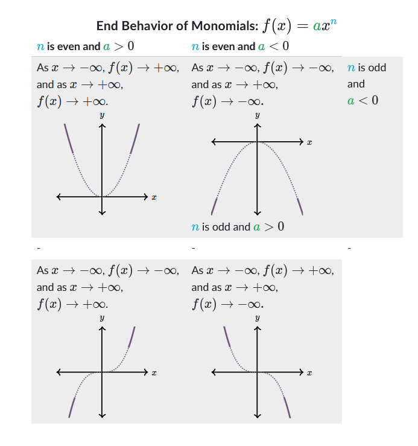

---
tags:
  - math
topic: polynomial
title: 多項式の終了動作
date: 2024-05-09
---

# 多項式の終了動作

> [!Info] 英語
> Polynomial (多項式) End (終了) Behavior (動作)

$f$関数の終了動作とは$x$軸の終了で関数のグラフの動作に記す。

例えば、多項式関数を考える。$x$軸で右へ行くを注意する、$f$のグラフの上へ行く。ので、$x$が大きいもう大きいになるよ、$f(x)$が大きいもう大きいになる。

数学で「$x\rightarrow\infty,f(x)\rightarrow\infty$」を書かれる。

一方でグラフの終了、「$x$」軸で左へ 行かれて、ｆのグラフで下へ行かれる。

数学で「$x\rightarrow-\infty,f(x)\rightarrow-\infty$」を書かれる。

## 代数で終了動作に定める。

多項式関数の方程式の終了動作を定まれる。
これは方程式をグラフするに有益。特に、２つの質問を答えられる。

- ついてに$x\rightarrow\infty$,$f(x)$に寄るを何ですか？
- ついてに$x\rightarrow-\infty$,$f(x)$に寄るを何ですか？

# 単項式の終了動作。

単項式関数は$y=ax^n$形式ので$a$が実数もう$n$が負の数である多項式です、

## 注意！

単項式の次数$n$と主係数$a$である終了動作を及ぼすに注意する。

- $n$が偶数の時、両方の端は関数の動作が同じ。
- $n$が奇数の時、両方の端は関数の動作が違う。

# グラフ無しで多項式の終了動作。

一般に、多項式関数の終了動作は主な項か最も大またな冪であるは同じです。
