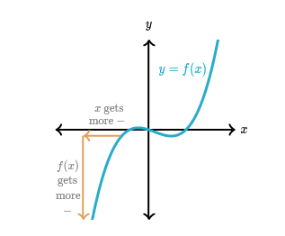
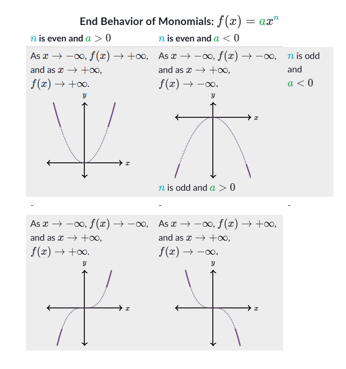

# 多項式の終了動作
英語: Polynomial ({多項式|たこうしき}) End ({終了|しゅうりょう}) Behavior ({動作|どうさ})

$f$関数の終了動作とは$x$軸の終了で関数のグラフの動作に記す。

例えば、多項式関数を考える。$x$軸で右へ行くを注意する、$f$のグラフの上へ行く。ので、$x$が大きいもう大きいになるよ、$f(x)$が大きいもう大きいになる。

数学で我$x\rightarrow\infty,f(x)\rightarrow\infty$を書く。

一方でグラフの終了、我らはｘ軸で左へ 行く、ｆのグラフで下へ行く。

数学で我$x\rightarrow-\infty,f(x)\rightarrow-\infty$を書く。

## {代数|だいすう}で終了動作に定める。
我らは多項式関数の方程式の終了動作を定める。
これは方程式をグラフするに有益。特に、我らは２つの質問を答える。
- ついてに$x\rightarrow\infty$,$f(x)$に寄るを何ですか？
- ついてに$x\rightarrow-\infty$,$f(x)$に寄るを何ですか？
# 単項式の終了動作。
単項式関数は$y=ax^n$形式ので$a$が実数もう$n$が負の数である多項式です、

## 注意！
単項式の次数$n$と主係数$a$である終了動作を及ぼすに注意する。

$n$が偶数のとき、両方の端は関数の動作が同じ。

$n$が奇数のとき、両方の端は関数の動作が違う。

# グラフ無しで多項式の終了動作。
一般に、多項式関数の終了動作は主な項か最も大またな冪であるは同じです。